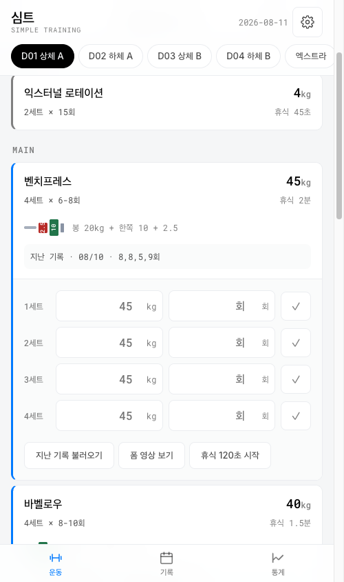
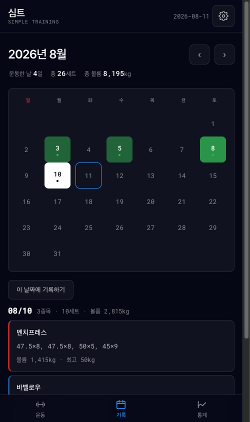
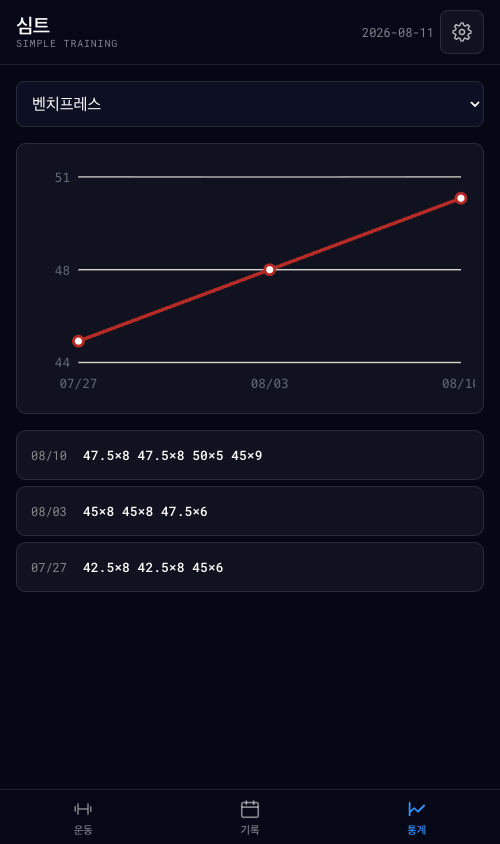
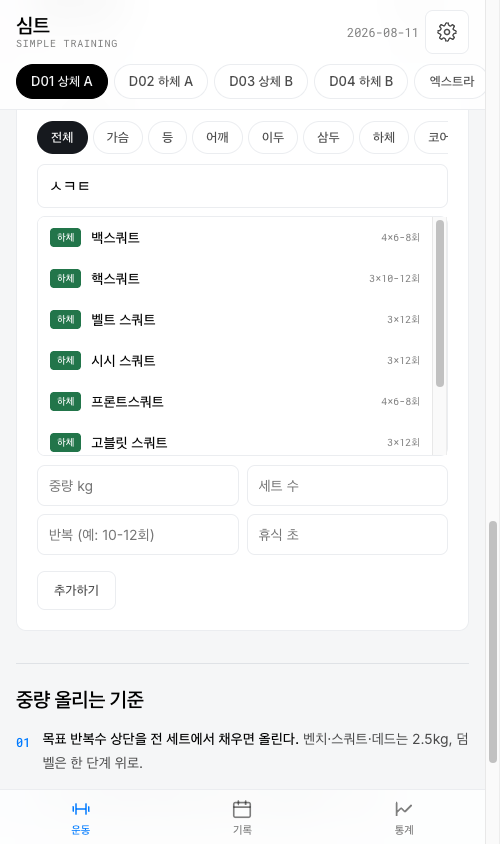

<div align="center">


# 심트 · Simple Training

**헬스장에서 한 손으로 쓰는 운동 기록 PWA**
빌드 도구 없이, 의존성 없이, 정적 파일 몇 개로.

[**▸ 앱 열기**](https://pongpongie.github.io/selfworkoutcheck/)

<br>


</div>

<br>

<table>
<tr>
<td width="25%"></td>
<td width="25%"></td>
<td width="25%"></td>
<td width="25%"></td>
</tr>
<tr>
<td align="center"><sub><b>운동</b> · 세트 기록</sub></td>
<td align="center"><sub><b>기록</b> · 볼륨 캘린더</sub></td>
<td align="center"><sub><b>통계</b> · 중량 추이</sub></td>
<td align="center"><sub><b>검색</b> · 초성 자동완성</sub></td>
</tr>
</table>

<br>

## 왜 만들었나

시중 운동 앱은 로그인을 요구하고, 광고가 붙고, 세트 하나 적는 데 탭이 다섯 번 필요했다.
**필요한 건 "지난주에 몇 kg 들었지?"에 3초 안에 답하는 것**뿐이었다.

그래서 계정도 서버도 없이, 열면 바로 쓰는 앱을 만들었다.
기록은 기기에만 남고, 신호가 없는 지하 헬스장에서도 돈다.

<br>

## 핵심 기능

|  | 기능 | 설명 |
|:-:|---|---|
| 📝 | **즉시 저장** | 저장 버튼이 없다. 칸에 값을 넣는 순간 `localStorage`로 들어간다 |
| 📅 | **볼륨 캘린더** | 운동한 날을 볼륨 농도 3단계로. **기록 없는 날도 눌러서 시작**할 수 있다 |
| 📋 | **하루 요약** | 운동 시간·개수·볼륨·세트를 한눈에. 메모도 남긴다 |
| 📈 | **중량 추이** | 종목별 최고 세트 중량 그래프. 차트 라이브러리 없이 SVG를 직접 그린다 |
| 🔍 | **초성 검색** | `ㅂㅊㅍㄹㅅ` → 벤치프레스. 8부위 144종목을 이름·초성·영문으로 |
| ➕ | **내 종목** | 없는 종목은 부위를 골라 등록. 한 번 만들면 계속 검색에 나온다 |
| 🗂 | **내 루틴** | 요일 칩 끝의 ＋ 로 나만의 루틴을 만든다. 이름 변경·삭제 가능 |
| ⏱ | **휴식 타이머** | 종료 시각 기반이라 화면이 꺼져도 시간이 안 틀어진다. 비프 + 진동 + Wake Lock |
| 🗓 | **지난 날짜 기록** | 헬스장에서 못 적었어도 날짜를 되돌려 적는다. 앞날은 막는다 |
| ➕ | **세트 가감** | 종목마다 세트를 늘리고 줄인다. 늘리면 직전 세트의 중량·반복수를 복사 |
| 🏋️ | **원판 계산** | 바벨 종목은 봉 20kg 기준 한쪽 원판 구성을 그림으로 |
| 💡 | **훈련 팁** | 중량 올리는 기준·세트·기록 습관. 매 화면에 깔지 않고 따로 뺐다 |
| 🌗 | **다크 · 라이트** | 시스템 · 라이트 · 다크 3분기. 첫 페인트 전에 적용해 깜빡임 없음 |
| 📦 | **백업** | JSON 내보내기 · 불러오기. 불러오기는 덮어쓰지 않고 **합친다** |
| ✈️ | **오프라인** | 한 번 열면 신호 없이 동작 |

<br>

## 기술 스택

프레임워크를 안 쓴 게 아니라, **안 써도 되는 규모라서 안 썼다.**
번들러·트랜스파일러·`node_modules` 없이 `python3 -m http.server` 하나로 개발이 끝난다.

| 영역 | 선택 | 이유 |
|---|---|---|
| **UI** | Vanilla JS (ES5 문법) | 앱 전체가 화면 4개. 가상 DOM보다 문자열 + `innerHTML`이 단순하다 |
| **상태** | 평범한 객체 + 전체 리렌더 | 상태 트리가 얕다. 상태 관리 라이브러리를 넣을 이유가 없었다 |
| **스타일** | CSS Custom Properties | 디자인 토큰을 `tokens.css` 한 곳에. 테마 교체가 값 치환으로 끝난다 |
| **저장** | `localStorage` + 스키마 검증 | 서버가 없다. 대신 들여오는 데이터는 전부 검증·클램프 |
| **오프라인** | Service Worker | cache-first + 백그라운드 갱신. 200 응답만 캐싱 |
| **차트** | 손으로 쓴 SVG | 꺾은선 하나에 차트 라이브러리 60KB는 과하다 |
| **테스트** | Node 표준 라이브러리 | 러너를 직접 썼다. `node test.js`, 종료 코드 0이면 통과 |
| **아이콘** | Python 표준 라이브러리 | PNG 인코더까지 직접. 의존성 0 원칙을 자산 생성까지 |
| **디자인** | DesignCode UI (Figma) | Design Tokens 플러그인으로 뽑은 JSON을 CSS 변수로 |

**쓴 웹 API** — Service Worker · Cache Storage · Wake Lock · Web Audio · Vibration ·
Storage Estimate · File / Blob · `prefers-color-scheme` · `matchMedia` · Safe Area Insets

<br>

## 구조

```
심트/
├── index.html          UI · 이벤트 · 인라인 스타일          2,644 lines
├── tokens.css          디자인 토큰 (라이트/다크)              219
├── core.js             순수 로직 — DOM·스토리지 무의존         516
├── exercises.js        종목 카탈로그 (데이터만)               232
├── test.js             단위 테스트 213개                      495
├── sw.js               서비스워커                              66
├── make-icons.py       아이콘 생성기                          154
├── manifest.json       PWA 매니페스트
└── icon-*.png          아이콘 3종 (76 KB)
```

### 레이어 분리

가장 신경 쓴 부분. **부작용이 있는 코드와 없는 코드를 갈랐다.**

```
┌─────────────────────────────────────────────┐
│  index.html   DOM · 이벤트 · localStorage    │  ← 부작용 담당
└──────────────────┬──────────────────────────┘
                   │ 인자로만 주고받음
┌──────────────────▼──────────────────────────┐
│  core.js      순수 함수 36개                 │  ← 부작용 없음
│               원판 계산 · 기록 조회 · 초성 검색
│               캘린더 집계 · 백업 검증 · SVG 차트
└─────────────────────────────────────────────┘
```

`core.js`는 브라우저에서 `window.Gym`, node에서 `module.exports`로 노출된다.
**같은 코드를 브라우저와 테스트가 그대로 공유한다.** 목킹이 필요 없다.

### 데이터 흐름

```
세트 칸에 45 입력
   → change 이벤트
   → ensureEntry("d1-bench", "2026-08-11", 4)
   → saveLogs()  →  localStorage["gym.logs.v1"]

기록은 종목이 바깥, 날짜가 안쪽으로 쌓인다.
   { "d1-bench": [ { date, sets: [{ w, r, done }] } ] }

캘린더는 이걸 날짜 기준으로 뒤집는다 (Gym.buildCalendar)
   { "2026-08-11": { count, sets, volume, exercises } }
```

별도의 "운동 세션" 레코드가 없다. **그날 뭔가 입력했으면 그날 운동한 것**으로 본다.

<br>

## 디자인 시스템

[DesignCode UI](https://designcode.io) 킷의 Figma 토큰을 `tokens.css`로 옮겼다.
색·타이포·간격을 여기서만 관리하므로 테마 교체가 값 치환으로 끝난다.

| | |
|---|---|
| **타이포** | Inter (UI) · Roboto Mono (숫자) — 헤딩 40/30/28/24, body 16, caption 13 |
| **뉴트럴** | `--n0` ~ `--n900` 19단계 |
| **액센트** | iOS 시스템 팔레트 — `#007aff` `#34c759` `#e8362c` `#af52de` |
| **콘텐츠** | 흑/백 알파 **100 / 70 / 50%** — 라이트·다크가 같은 규칙으로 돈다 |
| **간격** | 6 / 16 / 20 / 24 / 32 · radius 10·8 · **터치 타깃 44px** |

다크 모드는 킷이 다크 퍼스트라 값이 그대로 있다 — 배경 `#060715`, 보더 흰색 10%.

<br>

## 엔지니어링 노트

<details>
<summary><b>타이머가 백그라운드에서 느려지던 문제</b></summary>

<br>

`setInterval`로 매초 `left--` 하는 방식이었다. 화면이 꺼지면 틱이 누락되고,
**타이머가 멈추는 게 아니라 느려졌다.** 3분 휴식이 3분 20초가 되는 식으로.

종료 시각을 잡아두고 매번 현재 시각과 비교하도록 바꿨다.

```js
endAt = Date.now() + sec * 1000;
function remain() { return Math.max(0, Math.ceil((endAt - Date.now()) / 1000)); }
```

이러면 틱이 몇 번 빠져도 복귀했을 때 값이 정확하다.
`visibilitychange`에서 Wake Lock을 다시 잡고 값도 즉시 보정한다.

</details>

<details>
<summary><b>빈 기록이 무한히 쌓이던 문제</b></summary>

<br>

카드를 렌더할 때마다 오늘 날짜의 빈 엔트리를 `logs`에 넣고 있었다.
값을 하나만 입력해도 그 빈 엔트리들이 **전부 저장**돼서, 탭만 훑어도 하루 40개씩 쌓였다.

읽기(`Gym.viewSets`)와 쓰기(`ensureEntry`)를 분리하고, 저장할 때 빈 엔트리를 걷어낸다.
`Store.set`이 성공 여부를 돌려주게 해서 용량 초과도 배너로 알린다 —
전에는 조용히 삼켜서 **어느 날부터 저장이 안 되는데 알 수가 없었다.**

</details>

<details>
<summary><b>검색 순위: "벤치"를 치면 왜 벤치 딥스가 먼저 나왔나</b></summary>

<br>

둘 다 "벤치"로 시작하고 글자 수도 5로 같아서, 마지막 정렬 기준인 사전순으로 갔다.
**공백(U+0020)이 `프`보다 앞선다.** 그래서 `벤치 딥스`가 `벤치프레스`를 제쳤다.

같은 단어로 이어지는 앞부분 일치를 한 단계 위로 올렸다.

```
0  앞부분 일치 + 단어가 이어짐   벤치프레스
1  앞부분 일치 + 단어 경계       벤치 딥스
2  중간 일치                     클로즈그립 벤치프레스
3  영문 별칭                     bench press
```

</details>

<details>
<summary><b>서비스워커가 실패 응답까지 캐싱하던 문제</b></summary>

<br>

`res.ok` 검사가 없어서 배포 중 뜬 404나 502가 캐시에 영구히 박혔다.
cache-first라 그 뒤로 계속 깨진 응답이 나갔다.

```js
function cacheableSameOrigin(res) {
  return !!res && res.status === 200 && res.type === 'basic';
}
```

폰트는 `<link>`라 opaque(status 0)로 오니 예외를 뒀다 — 최악이라도 폰트만 안 뜬다.

</details>

<details>
<summary><b>아이콘 모서리가 흰색으로 구워지던 문제</b></summary>

<br>

SVG→PNG 변환기가 없어 Chrome으로 렌더링해 캡처했는데,
캡처는 페이지 배경 위에서 찍히니 **둥근 아이콘의 모서리가 투명이 아니라 흰색**이 됐다.

`make-icons.py`로 옮겼다. 표준 라이브러리만으로 그라디언트·마크·알파를 계산하고
PNG를 직접 인코딩한다. 둥근 사각형은 부호거리로 안티에일리어싱하고,
행마다 5개 필터를 다 시도해 제일 작은 걸 고른다.

캡처본 232KB → **76KB**, 모서리 알파 0 확인.

</details>

<details>
<summary><b>UI/UX: 탭 8개가 한 줄에 있던 문제</b></summary>

<br>

`D01 · D02 · D03 · D04 · 엑스트라 · 캘린더 · 기록 · 설정`

위계가 다른 것들이 섞여 있었다. 앞의 다섯은 *어떤 루틴인가*, 뒤의 셋은 *어떤 화면인가*다.
390px 폰에서는 다 안 들어가서 **설정이 화면 밖으로 잘렸다.**

```
심트                08/11  [💡][⚙]     ← 어쩌다 쓰는 건 헤더로
[D01][D02][D03][D04][엑스트라]          ← 요일은 운동 안의 2차 내비
   [운동]     [기록]     [통계]         ← 매일 쓰는 건 엄지가 닿는 곳
```

헬스장에서 한 손으로, 세트 사이에 쓰는 앱이다. 주 내비게이션은 하단에 있어야 한다.

</details>

<br>

## 테스트

의존성 없는 러너를 직접 썼다. 테스트할 가치가 있는 건 전부 `core.js`의 순수 함수라
DOM도 목킹도 필요 없다.

```bash
node test.js
#   ✓ 213 passed
```

<details>
<summary>무엇을 테스트하나</summary>

<br>

- **원판 계산** — `2.5 + 1.25`를 연달아 빼면 부동소수 오차가 남는다. EPS 없이는 1.25가 빠진다
- **날짜 이동** — 월·연·윤년 경계, 서머타임 구간(23시간/25시간짜리 날)
- **월 통계** — `'2026-1-'`로 자르면 `2026-10-*`가 딸려온다. 접두어 충돌 검증
- **초성 검색** — 부분 초성, 영문 별칭, 대소문자, 순위 규칙
- **백업 검증** — 잘못된 날짜, 배열 아닌 값, 범위 초과 클램프, XSS 페이로드
- **병합** — 원본 불변성, 같은 날짜 충돌 시 우선순위, 정렬
- **차트** — 값이 전부 같을 때 0 나누기, `NaN` 좌표

</details>

<br>

## 로컬 실행

```bash
git clone https://github.com/pongpongie/selfworkoutcheck.git
cd selfworkoutcheck
python3 -m http.server 8080     # http://localhost:8080
```

서비스워커는 **HTTPS 또는 localhost**에서만 등록된다.
파일을 더블클릭해 `file://`로 열면 PWA 기능이 동작하지 않는다.

```bash
node test.js                    # 테스트
python3 make-icons.py           # 아이콘 재생성
```

`index.html` · `tokens.css` · `core.js` · `exercises.js`를 고쳤으면
`sw.js`의 `CACHE` 값을 올려야 확실히 반영된다.

### 설치

- **Android / Chrome** — 주소창 메뉴 → "앱 설치"
- **iOS / Safari** — 공유 → "홈 화면에 추가" *(Chrome 아님, Safari로 열어야 함)*

<br>

## 알려진 제약

- **운동 시간은 직접 입력** — 세션 시작/종료 버튼이 없어 자동 측정은 못 한다.
  지난 날짜에 몰아 적는 경우가 있어 자동 측정이 오히려 틀린 값을 만든다
- **칼로리 없음** — 볼륨에서 칼로리를 뽑는 믿을 만한 공식이 없어 넣지 않았다
- **기기 간 동기화** — 서버가 없다. 백업 파일 내보내기/불러오기로만
- **iOS 알림** — 홈 화면에 추가한 경우만 가능. 현재는 비프음과 진동만
- **워밍업·어깨 서킷 ID 공유** — D01~D04가 같은 종목 ID를 쓴다.
  기록이 한 줄로 이어지는 대신, 같은 날 두 세션을 하면 나중 것이 덮어쓴다
- **폼 GIF** — 저작권 문제로 미포함. 유튜브 검색 링크로 대체

<br>

---

<div align="center">
<sub>개인 프로젝트 · <a href="https://pongpongie.github.io/selfworkoutcheck/">pongpongie.github.io/selfworkoutcheck</a></sub>
</div>
